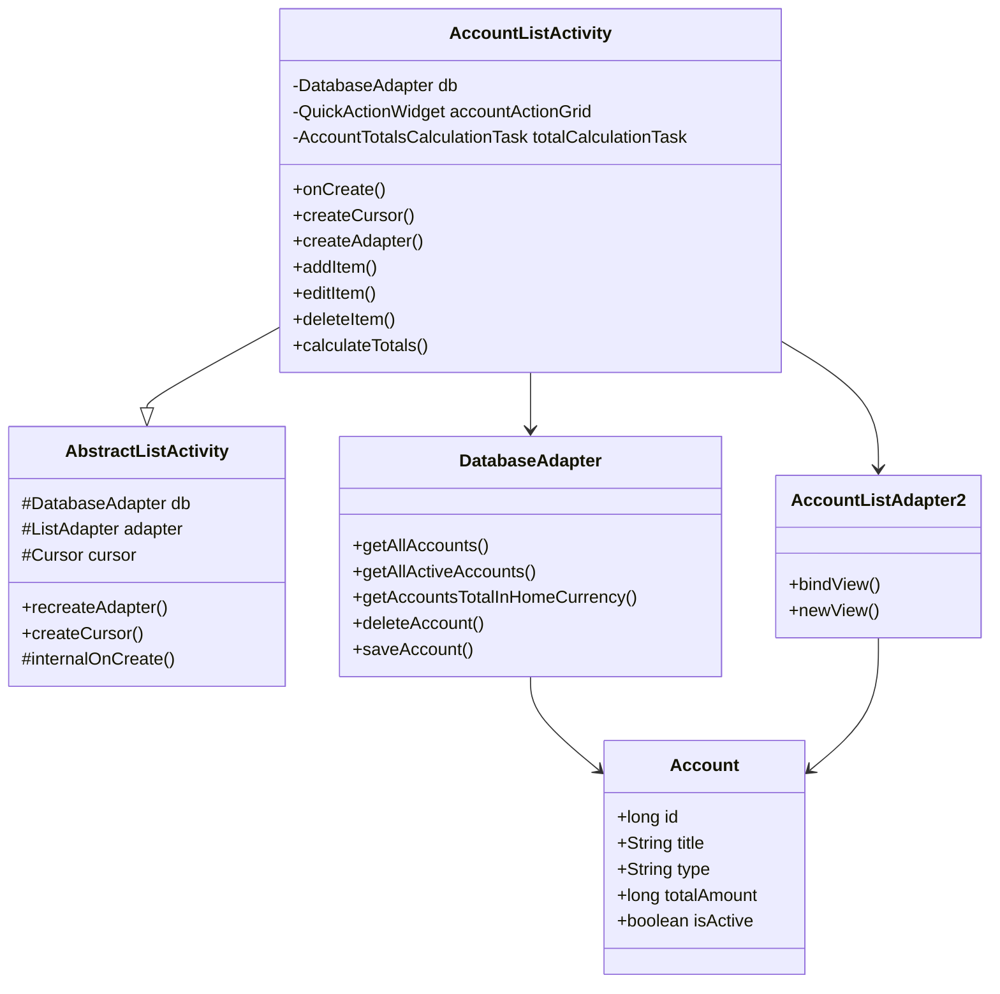
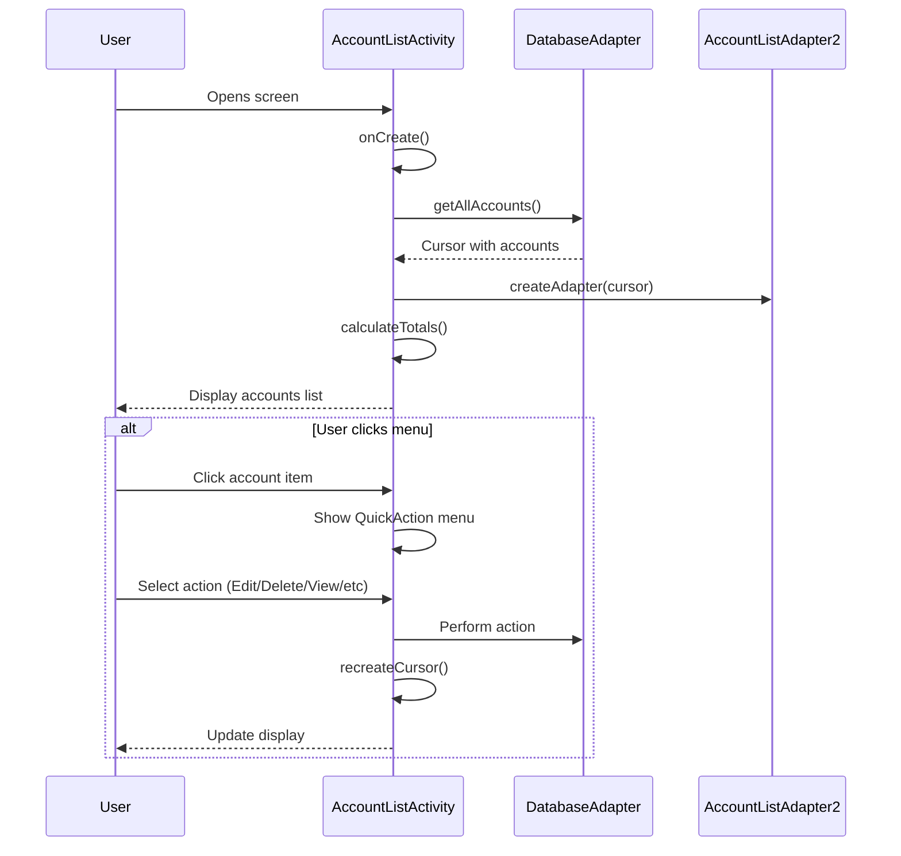

# Account List Screen Analysis

## Current Architecture Diagram

```mermaid
classDiagram
    class AccountListActivity {
        -DatabaseAdapter db
        -QuickActionWidget accountActionGrid
        -AccountTotalsCalculationTask totalCalculationTask
        +onCreate()
        +createCursor()
        +createAdapter()
        +addItem()
        +editItem()
        +deleteItem()
        +calculateTotals()
    }
    class AbstractListActivity {
        #DatabaseAdapter db
        #ListAdapter adapter
        #Cursor cursor
        +recreateAdapter()
        +createCursor()
        #internalOnCreate()
    }
    class AccountListAdapter2 {
        +bindView()
        +newView()
    }
    class DatabaseAdapter {
        +getAllAccounts()
        +getAllActiveAccounts()
        +getAccountsTotalInHomeCurrency()
        +deleteAccount()
        +saveAccount()
    }
    class Account {
        +long id
        +String title
        +String type
        +long totalAmount
        +boolean isActive
    }
    
    AccountListActivity --|> AbstractListActivity
    AccountListActivity --> DatabaseAdapter
    AccountListActivity --> AccountListAdapter2
    DatabaseAdapter --> Account
    AccountListAdapter2 --> Account
```

## Flow Diagram

```mermaid
sequenceDiagram
    participant User
    participant AccountList as AccountListActivity
    participant DB as DatabaseAdapter
    participant Adapter as AccountListAdapter2
    
    User->>AccountList: Opens screen
    AccountList->>AccountList: onCreate()
    AccountList->>DB: getAllAccounts()
    DB-->>AccountList: Cursor with accounts
    AccountList->>Adapter: createAdapter(cursor)
    AccountList->>AccountList: calculateTotals()
    AccountList-->>User: Display accounts list
    
    alt User clicks menu
        User->>AccountList: Click account item
        AccountList->>AccountList: Show QuickAction menu
        User->>AccountList: Select action (Edit/Delete/View/etc)
        AccountList->>DB: Perform action
        AccountList->>AccountList: recreateCursor()
        AccountList-->>User: Update display
    end
```
