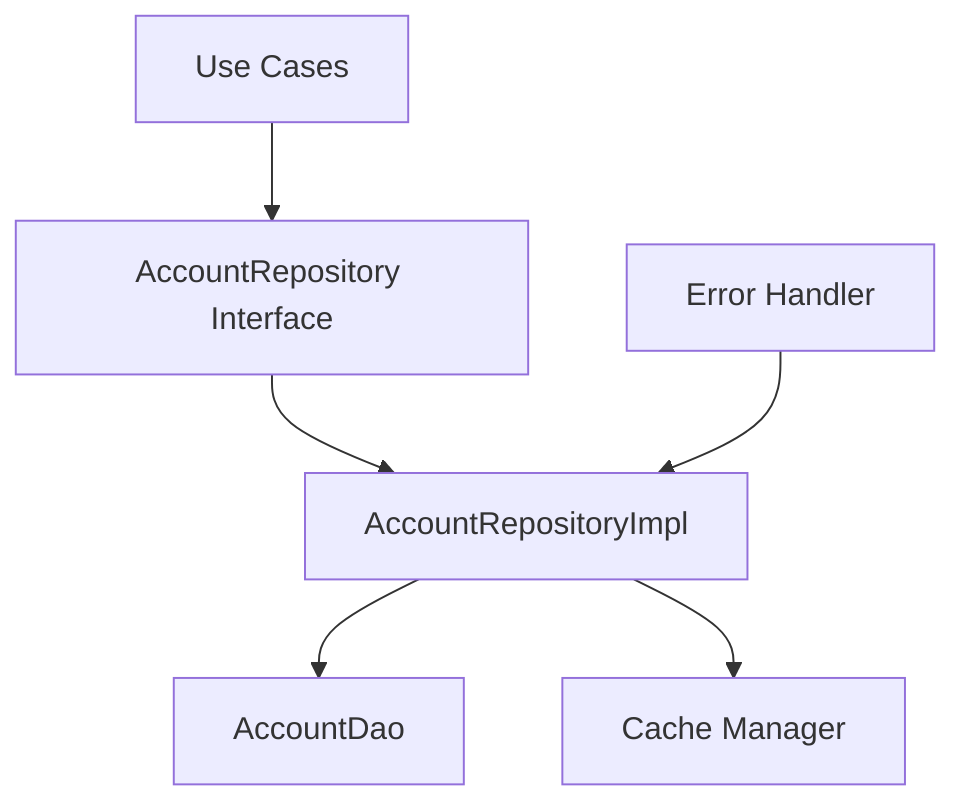
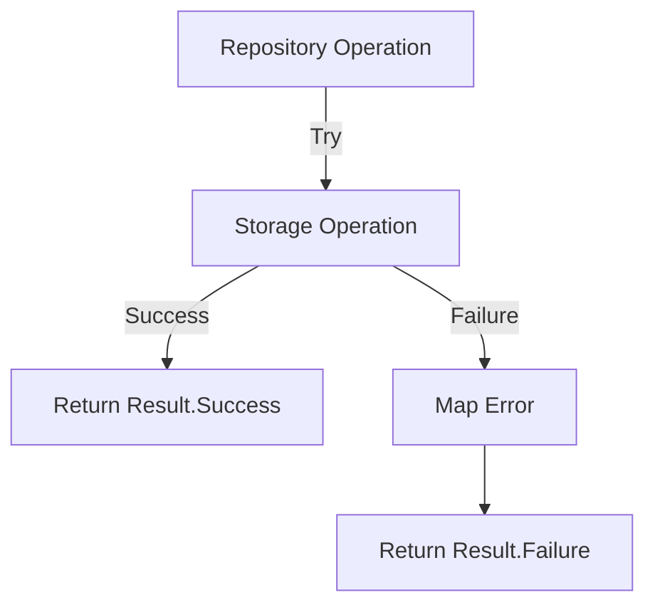

# Repository Layer Implementation for Account List

## Updates Based on Legacy Code Analysis

### Required Display Information
From `AccountListActivity.java` and `AccountListAdapter2.java`, we identified these display requirements:

1. Account Basic Info
   - Title
   - Type (with icon)
   - Status (active/inactive)
   - Total Amount
   - Creation/Last Transaction Date

2. Extended Account Info
   - Card issuer (for credit/debit cards)
   - Electronic payment type
   - Account number
   - Bank/Issuer name
   - Credit limit (for credit cards)

## Core Responsibilities
1. Abstract data source details from upper layers
2. Coordinate between multiple data sources (if applicable)
3. Handle caching strategies
4. Implement business rules related to data operations

## Old Implementation Analysis

### Account Repository Structure

The old implementation doesn't have a clear repository layer. Account operations are scattered across:

1. Direct Database Access: [`DatabaseAdapter.java`](../../app/src/main/java/ru/orangesoftware/financisto/db/DatabaseAdapter.java)
   - Lines ~100-200: Account CRUD operations
   - Direct exposure of database operations to UI layer

2. Business Logic Mix:
   ```mermaid
   graph TD
      A[Activity/Fragment] --> B[DatabaseAdapter]
      B --> C[DatabaseHelper]
      B --> D[MyEntityManager]
      D --> C
   ```

Issues in old implementation:
- No clear separation of concerns
- Direct database dependencies in UI layer
- Mixed business logic and data access
- No abstraction for testing

## Proposed New Implementation

### Modern Repository Architecture


### Components

1. Repository Interface
- [`AccountRepository.kt`](../../repository-api/src/main/java/ru/orangesoftware/financisto/repository/api/AccountRepository.kt)
  - Define contract for account operations
  - Pure Kotlin interface, no Android dependencies
  - Error handling through Result type

2. Repository Implementation
- [`AccountRepositoryImpl.kt`](../../repository-impl/src/main/java/ru/orangesoftware/financisto/repository/impl/AccountRepositoryImpl.kt)
  - Implements AccountRepository interface
  - Handles caching strategy
  - Coordinates with storage layer
  - Maps errors to domain exceptions

### Key Operations

1. Account Listing
```kotlin
suspend fun getAccounts(): Flow<List<Account>>
```
- Returns a Flow for reactive updates
- Handles caching/refresh strategy
- Manages error cases

2. Account Creation/Update
```kotlin
suspend fun saveAccount(account: Account): Result<Long>
```
- Validates account data
- Handles uniqueness constraints
- Manages transaction boundaries

3. Account Deletion
```kotlin
suspend fun deleteAccount(accountId: Long): Result<Unit>
```
- Handles cascading deletes
- Manages related data cleanup
- Ensures data consistency

### Error Handling Strategy


## Testing Strategy

1. Unit Tests
- Mock AccountDao
- Test caching behavior
- Verify error handling
- Test business rules

2. Integration Tests
- Test with real AccountDao
- Verify database operations
- Test transaction handling

## Next Steps
1. Implement AccountRepository interface
2. Create repository implementation
3. Add caching strategy if needed
4. Implement error handling
5. Write unit tests
6. Create integration tests
