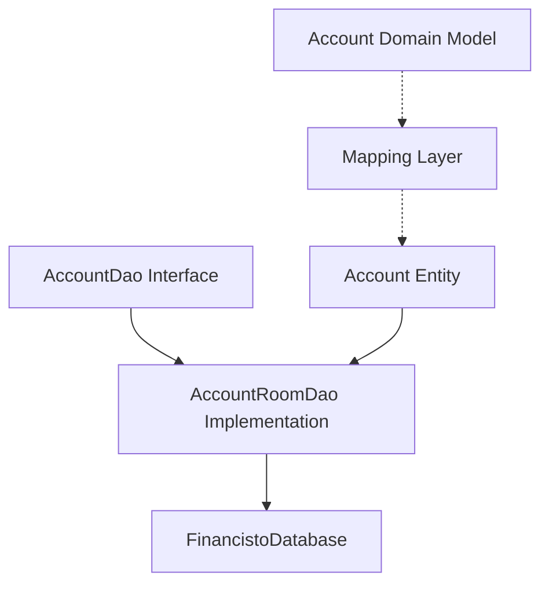
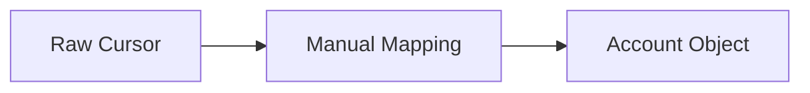
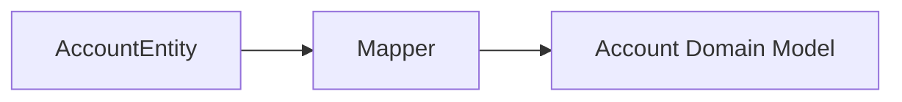

# Storage Layer Analysis for Account List Feature

## Overview

The storage layer is responsible for direct database interactions, providing a clean interface for storing and retrieving account data.

## Core Responsibilities
1. Store and retrieve account information
2. Handle database schema and migrations
3. Map database entities to domain models

## Old Implementation Analysis

### Account Storage Structure
The old implementation uses a direct SQLite approach with the following key components:

1. Database Helper: [`DatabaseHelper.java`](../../app/src/main/java/ru/orangesoftware/financisto/db/DatabaseHelper.java)
   - Manages database creation and version management
   - Line ~200: Account table creation
   - Line ~1200-1300: Account-related queries

2. Account Access:
   ```mermaid
   graph TD
      A[DatabaseAdapter] --> B[DatabaseHelper]
      B --> C[SQLiteDatabase]
      A --> D[MyEntityManager]
      D --> E[Account object mapping]
   ```

Key methods in old implementation:
- `DatabaseAdapter.getAllAccounts()`
- `MyEntityManager.saveAccount()`
- Direct SQL queries for filtering and sorting

## New Implementation

### Modern Architecture


### Components

1. Database Structure
- [`FinancistoDatabase.kt`](../../storage-impl/src/main/java/ru/orangesoftware/financisto/storage/impl/db/FinancistoDatabase.kt)
  - Room database configuration
  - Entity declarations
  - Database access methods

2. Data Access Objects
- [`AccountDao.kt`](../../storage-api/src/main/java/ru/orangesoftware/financisto/storage/api/dao/AccountDao.kt)
  - API contract for account operations
- [`AccountRoomDao.kt`](../../storage-impl/src/main/java/ru/orangesoftware/financisto/storage/impl/dao/AccountRoomDao.kt)
  - Room-specific implementation
  - Handles SQL queries through annotations

3. Entities
- [`Account.kt`](../../storage-api/src/main/java/ru/orangesoftware/financisto/storage/api/entities/Account.kt) (Domain Model)
- [`AccountEntity.kt`](../../storage-impl/src/main/java/ru/orangesoftware/financisto/storage/impl/entities/AccountEntity.kt) (Database Entity)

### Key Improvements
1. Clear separation between database entities and domain models
2. Type-safe queries using Room
3. Coroutine support for async operations
4. Clear API contracts through interfaces
5. Testable components due to interface-based design

## Mapping Layer Comparison

### Old Implementation


### New Implementation


## Next Steps
The Repository layer will build upon this foundation to:
1. Handle data operations logic
2. Provide caching if needed
3. Coordinate between different data sources (if any)
4. Handle business rules related to account data management
