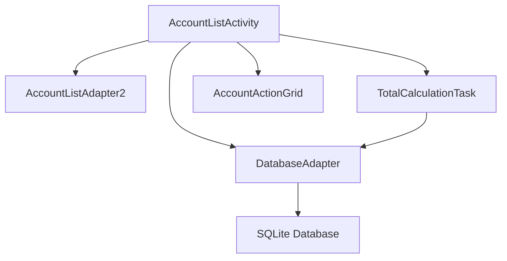
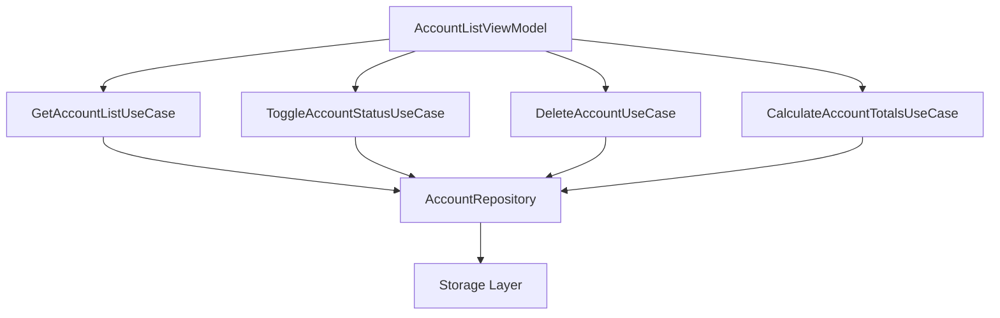
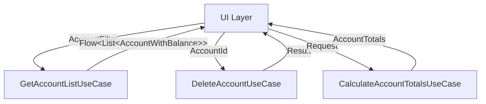
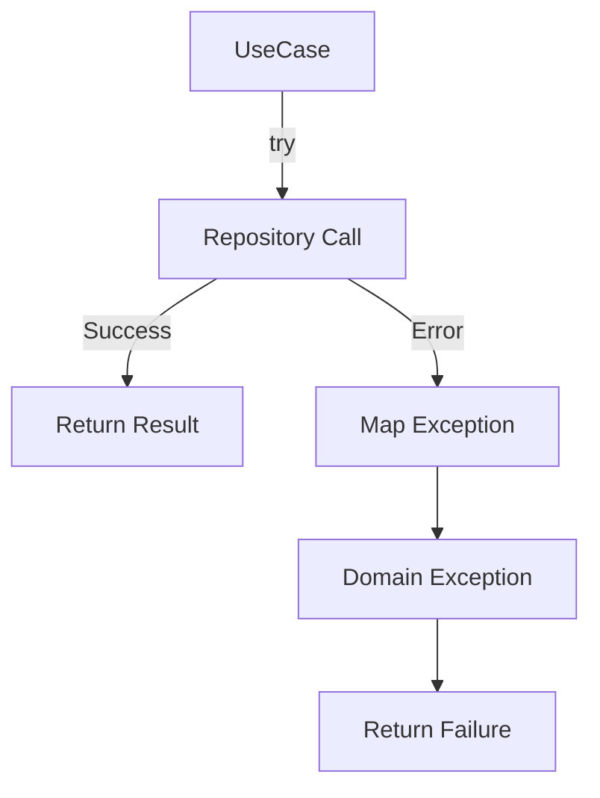

# Use Case Layer Analysis for Account List Feature

## Overview of Legacy Implementation

The account list functionality in the old code is primarily handled in `AccountListActivity.java` with business logic scattered across multiple components:

### Current Structure


### Core Functionality

1. Account Management:
   - View all accounts
   - Filter active/inactive accounts
   - Calculate account totals
   - Account CRUD operations

2. Account Actions (from `prepareAccountActionGrid`):
   ```java
   accountActionGrid.addQuickAction(new MyQuickAction(this, R.drawable.ic_action_info, R.string.info));
   accountActionGrid.addQuickAction(new MyQuickAction(this, R.drawable.ic_action_list, R.string.blotter));
   accountActionGrid.addQuickAction(new MyQuickAction(this, R.drawable.ic_action_edit, R.string.edit));
   // ... more actions
   ```

3. Totals Calculation (from `AccountTotalsCalculationTask`):
   ```java
   public Total getTotalInHomeCurrency() {
       return db.getAccountsTotalInHomeCurrency();
   }
   ```

## Proposed Modern Architecture

### New Structure


### Use Cases

From the legacy code's `prepareAccountActionGrid` method:
```java
accountActionGrid.addQuickAction(new MyQuickAction(this, R.drawable.ic_action_info, R.string.info));          // 1. Show Info
accountActionGrid.addQuickAction(new MyQuickAction(this, R.drawable.ic_action_list, R.string.blotter));       // 2. Show Transactions
accountActionGrid.addQuickAction(new MyQuickAction(this, R.drawable.ic_action_edit, R.string.edit));          // 3. Edit Account
accountActionGrid.addQuickAction(new MyQuickAction(this, R.drawable.ic_action_add, R.string.transaction));    // 4. Add Transaction
accountActionGrid.addQuickAction(new MyQuickAction(this, R.drawable.ic_action_transfer, R.string.transfer));  // 5. Add Transfer  
accountActionGrid.addQuickAction(new MyQuickAction(this, R.drawable.ic_action_tick, R.string.balance));       // 6. Update Balance
accountActionGrid.addQuickAction(new MyQuickAction(this, R.drawable.ic_action_flash, R.string.delete_old_transactions)); // 7. Purge
accountActionGrid.addQuickAction(new MyQuickAction(this, R.drawable.ic_action_lock_closed, R.string.close_account));     // 8. Toggle Status
accountActionGrid.addQuickAction(new MyQuickAction(this, R.drawable.ic_action_trash, R.string.delete_account));         // 9. Delete
```

These actions map to the following use cases:

1. `GetAccountListUseCase`:
   ```kotlin
   class GetAccountListUseCase(private val repository: AccountRepository) {
       operator fun invoke(filter: AccountFilter): Flow<List<AccountWithBalance>>
       // Returns a Flow of accounts with their balances
   }
   ```

2. `GetAccountDetailsUseCase`:
   ```kotlin
   class GetAccountDetailsUseCase(private val repository: AccountRepository) {
       suspend operator fun invoke(accountId: Long): AccountDetails
       // Returns detailed account information including transaction summary
   }
   ```

3. `GetAccountTransactionsUseCase`:
   ```kotlin
   class GetAccountTransactionsUseCase(private val repository: AccountRepository) {
       operator fun invoke(accountId: Long, filter: TransactionFilter): Flow<List<Transaction>>
       // Returns account transactions with optional filtering
   }
   ```

4. `AddTransactionUseCase`:
   ```kotlin
   class AddTransactionUseCase(private val repository: AccountRepository) {
       suspend operator fun invoke(accountId: Long, transaction: Transaction): Result<Long>
       // Creates new transaction for the account
   }
   ```

5. `AddTransferUseCase`:
   ```kotlin
   class AddTransferUseCase(private val repository: AccountRepository) {
       suspend operator fun invoke(fromAccountId: Long, toAccountId: Long, transfer: Transfer): Result<Long>
       // Creates transfer between accounts
   }
   ```

6. `UpdateAccountBalanceUseCase`:
   ```kotlin
   class UpdateAccountBalanceUseCase(private val repository: AccountRepository) {
       suspend operator fun invoke(accountId: Long, newBalance: Money): Result<Unit>
       // Updates account balance with reconciliation transaction
   }
   ```

7. `PurgeAccountTransactionsUseCase`:
   ```kotlin
   class PurgeAccountTransactionsUseCase(private val repository: AccountRepository) {
       suspend operator fun invoke(accountId: Long, beforeDate: LocalDate): Result<Int>
       // Deletes old transactions before specified date
   }
   ```

8. `ToggleAccountStatusUseCase`:
   ```kotlin
   class ToggleAccountStatusUseCase(private val repository: AccountRepository) {
       suspend operator fun invoke(accountId: Long): Result<Unit>
       // Toggles account between active and inactive states
   }
   ```

9. `DeleteAccountUseCase`:
   ```kotlin
   class DeleteAccountUseCase(private val repository: AccountRepository) {
       suspend operator fun invoke(accountId: Long): Result<Unit>
       // Handles account deletion with validation
   }
   ```

10. `CalculateAccountTotalsUseCase`:
    ```kotlin
    class CalculateAccountTotalsUseCase(private val repository: AccountRepository) {
        suspend operator fun invoke(): AccountTotals
        // Calculates totals for all currencies and converts to home currency
    }
    ```

### Domain Models

1. `AccountWithBalance`:
   ```kotlin
   data class AccountWithBalance(
       val account: Account,
       val balance: Money,
       val limitInfo: CreditLimitInfo? = null
   )
   ```

2. `AccountDetails`:
   ```kotlin
   data class AccountDetails(
       val account: Account,
       val balance: Money,
       val limitInfo: CreditLimitInfo? = null,
       val transactionsSummary: TransactionsSummary,
       val lastTransaction: Transaction?
   )
   ```

3. `TransactionsSummary`:
   ```kotlin
   data class TransactionsSummary(
       val totalTransactions: Int,
       val lastTransactionDate: LocalDateTime?,
       val oldestTransactionDate: LocalDateTime?,
       val income: Money,
       val expense: Money
   )
   ```

4. `Transaction`:
   ```kotlin
   data class Transaction(
       val id: Long = 0,
       val accountId: Long,
       val type: TransactionType,
       val amount: Money,
       val date: LocalDateTime,
       val note: String? = null
   )
   ```

5. `Transfer`:
   ```kotlin
   data class Transfer(
       val amount: Money,
       val fromAccountAmount: Money,
       val toAccountAmount: Money,
       val date: LocalDateTime,
       val note: String? = null
   )
   ```

6. `AccountTotals`:
   ```kotlin
   data class AccountTotals(
       val byCurrency: Map<Currency, Money>,
       val inHomeCurrency: Money
   )
   ```

7. `Money`:
   ```kotlin
   data class Money(
       val amount: BigDecimal,
       val currency: Currency
   )
   ```

8. `AccountFilter`:
   ```kotlin
   data class AccountFilter(
       val showInactive: Boolean = false,
       val type: AccountType? = null
   )
   ```

9. `TransactionFilter`:
   ```kotlin
   data class TransactionFilter(
       val fromDate: LocalDateTime? = null,
       val toDate: LocalDateTime? = null,
       val type: TransactionType? = null,
       val minAmount: Money? = null,
       val maxAmount: Money? = null
   )
   ```

### Error Handling

```kotlin
sealed class AccountUseCaseException : Exception() {
    // Account-related errors
    data class AccountNotFound(val accountId: Long) : AccountUseCaseException()
    data class HasTransactions(val accountId: Long) : AccountUseCaseException()
    data class InactiveAccount(val accountId: Long) : AccountUseCaseException()
    
    // Balance-related errors
    data class InsufficientBalance(val accountId: Long, val available: Money, val required: Money) : AccountUseCaseException()
    data class InvalidBalanceUpdate(val accountId: Long, val message: String) : AccountUseCaseException()
    
    // Transaction-related errors
    data class TransactionNotFound(val transactionId: Long) : AccountUseCaseException()
    data class InvalidTransactionAmount(val amount: Money) : AccountUseCaseException()
    data class TransactionDateInFuture(val date: LocalDateTime) : AccountUseCaseException()
    
    // Transfer-related errors
    data class SameAccountTransfer(val accountId: Long) : AccountUseCaseException()
    data class InvalidTransferAmount(val fromAmount: Money, val toAmount: Money) : AccountUseCaseException()
    data class IncompatibleCurrencies(val fromCurrency: Currency, val toCurrency: Currency) : AccountUseCaseException()
    
    // Purge-related errors
    data class PurgeFailure(val accountId: Long, val message: String) : AccountUseCaseException()
    data class InvalidPurgeDate(val date: LocalDate) : AccountUseCaseException()
}
```

## Implementation Strategy

1. Data Flow:


2. Error Handling:


3. Testing Strategy:
- Unit test each use case independently
- Mock repository for use case tests
- Integration tests with real repository
- UI tests for complete flow

## Migration Plan

1. Create use case interfaces
2. Implement use cases using repository
3. Add unit tests
4. Integrate with ViewModel
5. Update UI to observe use case results
