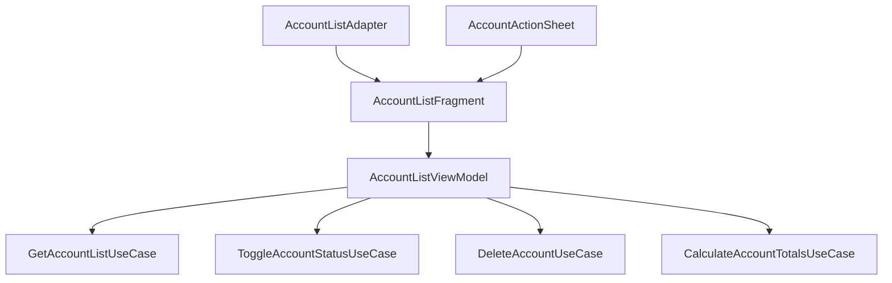
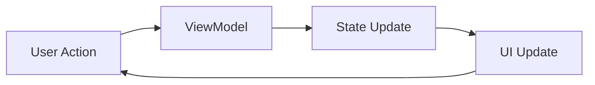

# View Model Layer Analysis for Account List Feature

## Legacy Implementation Overview

The account list functionality in the legacy codebase is primarily handled by `AccountListActivity` which directly interacts with repositories and manages UI state. This tightly coupled implementation makes the code hard to test and maintain.

### Current Issues

1. Direct Database Access
```java
// AccountListActivity directly uses DatabaseAdapter
private DatabaseAdapter db;
private AccountListAdapter2 accountsAdapter;

protected void calculateTotals() {
    new AccountTotalsCalculationTask(db, view, accountsAdapter).execute();
}
```

2. UI State Management
- State is scattered across multiple fields
- Manual sync between account list and totals
- Complex lifecycle management
- No handling of configuration changes

3. Event Handling
```java
// Mixing business logic with UI code
@Override
public void onItemClick(int position) {
    Account account = accountsAdapter.getItem(position);
    Intent intent = new Intent(this, BlotterActivity.class);
    intent.putExtra(BlotterActivity.EXTRA_ACCOUNT_ID, account.id);
    startActivity(intent);
}
```

4. Error Handling
- Mostly relies on try-catch blocks
- No consistent error handling strategy
- Error states not reflected in UI properly

## Proposed Modern Architecture

### Component Structure



### Key Components

1. AccountListViewModel
- Central point for business logic
- Manages UI state using StateFlow
- Handles user actions and UI events
- Coordinates between use cases

2. AccountListState
```kotlin
data class AccountListState(
    val accounts: List<AccountListItem> = emptyList(),
    val totals: AccountTotals? = null,
    val isLoading: Boolean = false,
    val error: AccountListError? = null,
    val filterActive: Boolean = true
)

sealed class AccountListError {
    data class LoadError(val message: String) : AccountListError()
    data class DeleteError(val accountId: Long, val message: String) : AccountListError()
    data class BalanceError(val accountId: Long, val message: String) : AccountListError()
}

data class AccountListItem(
    val account: Account,
    val formattedBalance: String,
    val isExpanded: Boolean = false
)
```

3. AccountListEvent
```kotlin
sealed class AccountListEvent {
    data class AccountSelected(val id: Long) : AccountListEvent()
    data class AccountDeleted(val id: Long) : AccountListEvent()
    data class BalanceUpdated(val id: Long) : AccountListEvent()
    data class ToggleExpanded(val id: Long) : AccountListEvent()
    data class StatusToggled(val id: Long) : AccountListEvent()
    object FilterToggled : AccountListEvent()
    object ErrorDismissed : AccountListEvent()
}
```

4. AccountActionSheet
- Material Bottom Sheet for account actions
- Displays contextual actions based on account type
- Handles action delegation back to ViewModel

### State Management

1. One-Way Data Flow


2. Error Handling
- All errors captured in AccountListError
- Displayed as Snackbars with retry option
- Automatic dismissal after timeout
- Manual dismissal through ErrorDismissed event

3. Loading States
```kotlin
// Handled through state class
viewModel.state.collect { state ->
    binding.progressBar.isVisible = state.isLoading
    binding.accountList.isVisible = !state.isLoading && state.error == null
    binding.errorView.isVisible = state.error != null
}
```

### Navigation

1. Navigation Actions
```kotlin
sealed class AccountListNavigation {
    data class ToTransactions(val accountId: Long) : AccountListNavigation()
    data class ToEditAccount(val accountId: Long) : AccountListNavigation()
    object ToCreateAccount : AccountListNavigation()
}
```

2. Implementation using Navigation Component
- Type-safe arguments using NavArgs
- Shared element transitions for material design
- Deep linking support

### Testing Strategy

1. ViewModel Tests
- Unit tests for state transitions
- Use case interaction verification
- Error handling scenarios
- Configuration change simulation

2. UI Tests
- Navigation flows
- List interactions
- Error states
- Account actions
- Filter behavior

3. Integration Tests
- End-to-end flows with real data
- State persistence
- Memory leak checks

### Implementation Plan

1. Phase 1: Basic Setup
- Create ViewModel and State classes
- Basic list display with loading state
- Error handling infrastructure

2. Phase 2: Core Features
- Account list display with balances
- Total calculations
- Basic actions (view, edit, delete)

3. Phase 3: Enhanced Features
- Filter implementation
- Expanded view states
- Animation and transitions
- Action sheet implementation

4. Phase 4: Polish
- Error handling improvements
- State persistence
- Performance optimizations
- UI refinements
